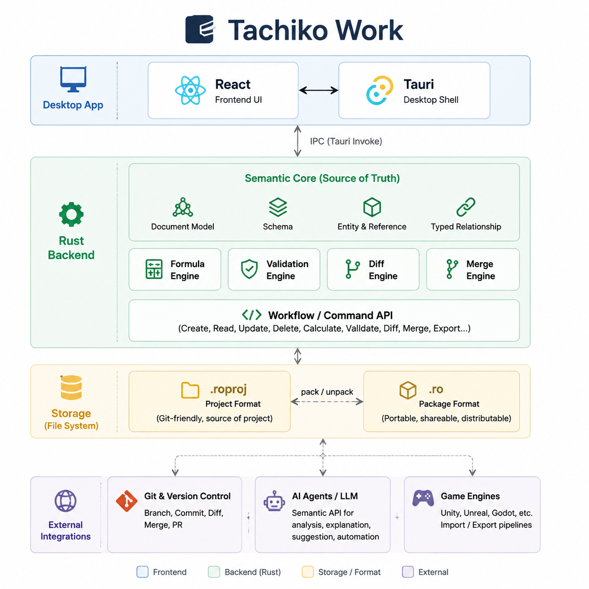

# Tachiko Work

**A semantic workspace for structured data and computation, built so humans, Git,
and AI can work on the same meaning instead of reverse-engineering files.**

Tachiko Work targets workflows where structured work drifts across spreadsheets,
CSV exports, scripts, Git diffs, and AI prompts. Instead of treating cell
positions, file layout, or UI state as the source of meaning, Tachiko keeps typed
schemas, entities, references, formulas, validation, and semantic changes in one
deterministic model.

Under the hood, Tachiko is **Rust-native, Git-native, and AI-native**: deterministic
Rust engines own semantic facts, Git remains an optional review/storage protocol,
and AI operates through semantic queries and typed proposals rather than raw file
or UI mutation.

The first product wedge is **game-balance data for technical designers and
developers**. The complete workflow remains CLI-first, and the repository now
also contains the first browser Designer vertical slice: a bounded typed table
over the resident Rust runtime. The active roadmap horizon is
[`06 · Team Workspace Beta`](docs/product/product-roadmap.md), focused on making
semantic work reviewable and collaborative through machine deltas, deterministic
merge/conflicts, history policy, permissions, and team review workflows.

> **Public pre-alpha:** the repository is intentionally public for inspection and
> early feedback. There is no tagged binary release yet, the graphical Designer
> is not packaged or released yet, and APIs, formats, and contribution policy are
> still evolving. The licensing direction is founder-accepted, while its legal
> implementation remains pending under issue #202.

## What works today

On current `main`, Tachiko already provides an end-to-end game-balance proof with:

- typed schemas, entities, fields, stable semantic IDs, and references;
- deterministic formulas, dependency tracking, validation, semantic diff/impact,
  and typed three-way merge;
- canonical editable `.roproj/v1`; deterministic portable package profile
  `tachiko.portable-package/v1` as the current Provisional `.ro` filename form, with
  distinct supported direct representation `direct-ro/v2`;
- standalone local workflows plus optional provider-neutral Git/CI review;
- provider-free semantic inspection, formula/scenario reasoning, and bounded
  Analysis Query results with reproducibility lineage;
- approval-gated semantic proposals rather than raw AI file mutation;
- a Rust-authoritative resident runtime with revision-safe commands, bounded
  projections/invalidation, retained incremental state, and native/WASM
  conformance evidence;
- a first-party browser/Worker/WASM Designer slice that opens bounded canonical
  `.roproj/v1` projects, browses typed tables, applies revision-safe
  Text/Number/Boolean edits, selectively refreshes formulas, atomically Saves As
  a new browser-local project, and reopens that exact state after resident
  teardown without treating frontend state as canonical. The built-in Moonfall
  demo and repository-owned Product Gap dogfood project exercise two distinct
  domains over the same runtime.

The current product deliberately does **not** claim a completed spreadsheet UI,
Office compatibility, realtime collaboration, cloud SaaS, or production
 game-engine plugins.

## Why this is different

| Common workflow problem | Tachiko approach |
| --- | --- |
| A spreadsheet quietly becomes a database plus domain rules | Schema, values, references, formulas, and validation have explicit typed meaning |
| Review is reduced to raw text/binary file changes | Semantic diff and dependency/impact facts are computed by deterministic engines |
| CSV/export glue becomes part of the unofficial workflow | Canonical project state, deterministic export, and optional Git/CI adapters share the same semantic source |
| AI must infer meaning from raw files or simulate UI actions | AI consumes semantic queries and proposes typed operations; deterministic Rust engines remain authoritative |

Git is a first-class optional storage/review protocol, not the semantic model or
the user interface. AI is a semantic client, not an alternate source of truth.

## Start here

- **Run the proof:** [Try it in five minutes](#try-it-in-five-minutes)
- **Run the Designer slice:** [`apps/designer/`](apps/designer/README.md)
- **See the durable example:** [`examples/game-balance/`](examples/game-balance/README.md)
- **Inspect the self-dogfood project:** [`dogfood/product-gaps.roproj/`](dogfood/product-gaps.roproj/)
- **See where the product is going:** [Product Roadmap](docs/product/product-roadmap.md)
- **Understand the system:** [Architecture overview](#architecture-overview)
- **Understand contribution status:** [`CONTRIBUTING.md`](CONTRIBUTING.md)
- **Understand decision authority:** [`docs/README.md`](docs/README.md)

## Vision

Tachiko Work is not an Office clone.

It is a semantic document platform where structured data, formulas, Git review,
and AI operations share one typed model. Traditional document and spreadsheet
views are future projections of that model rather than separate sources of
truth.

## First usable product

The current product provides a complete, safe CLI-first game-balance workflow:

- typed schemas, entities, fields, and references;
- opaque stable semantic IDs with ergonomic mutable keys;
- canonical identity-aware `.ro` v2 serialization plus deterministic legacy-v1 migration;
- canonical editable `.roproj/v1` materialization, validation, and bounded
  canonicalization as an exact 18-file project tree;
- deterministic portable-package/v1 pack, verified unpack, and read-only
  package/tracked-source comparison over those exact project bytes;
- an optional provider-neutral Git/CI adapter with canonical LF text
  attributes, `.roproj` semantic review, validation, and package/source drift
  checks;
- deterministic formula calculation and dependency tracking;
- semantic diff with derived formula impact;
- guided starter creation, browsing, explanation, and typed edits;
- validated entity duplication, relationship-safe rename, and protected removal;
- bounded formula creation and revision with canonical expression syntax:
  `finite literal`, `+ - * /`, unary signs, parentheses,
  `[entity.field]` references, and `min`/`max`;
- CLI validation and evaluated runtime JSON export;
- provider-free read-only Semantic Analyst queries for structure, formulas,
  upstream dependencies, downstream impact, changes, affected areas, and
  validation findings, plus approval-required suggestions;
- bounded typed semantic Analysis Query selection, optional stable-ID
  narrowing, zero/one grouping field, exact membership and Count, Number
  Min/Max, bounded Number observations, paired exact contexts, and structured
  reproducibility lineage.

It deliberately does not include a completed/general spreadsheet UI, Office compatibility,
realtime collaboration, cloud infrastructure, or game-engine plugins.

## Installation status

Tachiko Work does not yet have a tagged or published binary release. Until the
first release is published, install the CLI from a repository checkout. This
requires Rust 1.85 or newer:

```sh
cargo install --path crates/cli --locked
tachiko --version
# tachiko 0.1.0
```

The installed binary is named `tachiko`. Contributors can instead use
`cargo run -p tachiko-cli -- <command>` without installing it.

### Binary archives after the first release

The release workflow is ready to produce one native archive for each supported
target, but these files will not exist until an exact version tag has passed the
release workflow and its draft has been reviewed and published:

```text
tachiko-0.1.0-x86_64-unknown-linux-gnu.tar.gz
tachiko-0.1.0-aarch64-apple-darwin.tar.gz
tachiko-0.1.0-x86_64-apple-darwin.tar.gz
tachiko-0.1.0-x86_64-pc-windows-msvc.tar.gz
```

The GitHub repository is intentionally public during pre-alpha development.
Publishing a GitHub release remains a separate release-owner decision; no tag or
binary release exists merely because the source repository is public.

Download the matching archive and its adjacent `.sha256` file from the same
release. On Linux or macOS, run the checksum command for your platform and then
extract the archive:

```sh
archive=tachiko-0.1.0-aarch64-apple-darwin.tar.gz

sha256sum --check "$archive.sha256"       # Linux
shasum -a 256 --check "$archive.sha256"  # macOS

tar -xzf "$archive"
"./${archive%.tar.gz}/tachiko" --version
# tachiko 0.1.0
```

On Windows x86-64, PowerShell can verify and extract the release without extra
tools:

```powershell
$Archive = "tachiko-0.1.0-x86_64-pc-windows-msvc.tar.gz"
$Expected = ((Get-Content "${Archive}.sha256" -Raw).Trim() -split '\s+')[0].ToLowerInvariant()
$Actual = (Get-FileHash -Algorithm SHA256 $Archive).Hash.ToLowerInvariant()
if ($Actual -ne $Expected) { throw "SHA-256 checksum mismatch" }

tar.exe -xzf $Archive
& ".\tachiko-0.1.0-x86_64-pc-windows-msvc\tachiko.exe" --version
# tachiko 0.1.0
```

The initial archives are checksummed but are not signed, and the macOS binaries
are not notarized. Operating systems may warn or block execution. If your
environment requires signed software, build from reviewed source instead of
bypassing its security policy.

Every archive also includes `THIRD_PARTY_LICENSES.md`, the generated inventory
and exact license/notice texts for the locked dependencies used by the CLI.
Revisions already published under `Apache-2.0 OR MIT` retain those historical
license grants. Issue #15 records the founder-accepted long-term direction,
while issue #202 remains the legal implementation gate; see
[`docs/governance/licensing-posture.md`](docs/governance/licensing-posture.md).

## Try it in five minutes

Create a project you can immediately understand:

```sh
tachiko_demo=$(mktemp -d "${TMPDIR:-/tmp}/tachiko-demo.XXXXXX")
tachiko init "$tachiko_demo/balance.ro" --title "My Game Balance"
tachiko show "$tachiko_demo/balance.ro"
tachiko explain "$tachiko_demo/balance.ro" iron_sword.dps
tachiko analyze field "$tachiko_demo/balance.ro" iron_sword.dps \
  --source-state working-copy
```

Make a safe balance change. Tachiko creates a new document, checks it, and
shows both the direct edit and its derived impact:

```sh
tachiko set "$tachiko_demo/balance.ro" iron_sword.damage 45 \
  --output "$tachiko_demo/buffed.ro"
tachiko diff "$tachiko_demo/balance.ro" "$tachiko_demo/buffed.ro"
tachiko validate "$tachiko_demo/buffed.ro"
tachiko export "$tachiko_demo/buffed.ro" "$tachiko_demo/buffed.json"
tachiko analyze changes \
  "$tachiko_demo/balance.ro" "$tachiko_demo/buffed.ro" \
  --before-state base --after-state buffed
```

`tachiko analyze document|field|changes|validation` emits deterministic JSON
without an LLM provider. Optional state labels are opaque caller-owned evidence
(for example a path, commit, or fixture name); they are not revision tokens or
mutation authority.

`tachiko analyze query` emits deterministic structured JSON for the same
bounded normalized query over one source or, with `--compare`, two explicitly
supplied exact sources. Predicates use
`FIELD:OPERATOR:TYPE:VALUE`; supported result requests are `membership`,
`count`, `min:FIELD`, `max:FIELD`, and `observations:FIELD`. Formula-backed
Number values use the same calculator as the rest of the workspace, and a
failure or disclosure denial never returns a partial aggregate.

This command syntax and JSON shape are Provisional implementation evidence for
Issue #150, not a stabilized public wire or SDK contract. Broader
production-analysis surfaces remain Deferred under the governing Analysis Query
contract.

The command targets the opaque stable IDs shown by `tachiko show` and
`tachiko analyze document`, not mutable human keys. The checked-in Moonfall
example provides a complete executable query using its deterministic IDs in
[`examples/game-balance/README.md`](examples/game-balance/README.md#cli-workflow).

The checked-in Moonfall example and expected output are documented in
[`examples/game-balance/README.md`](examples/game-balance/README.md).

Use `tachiko init scratch.ro --template empty` only when you intentionally want
to author schemas and entities directly in canonical `.ro` JSON.

## Work with canonical `.roproj/v1`

Materialize an existing direct `.ro` document, validate an exact canonical
project tree, or explicitly canonicalize an admitted bounded non-canonical
tree:

```sh
tachiko roproj materialize balance.ro balance.roproj
tachiko roproj validate balance.roproj
tachiko roproj canonicalize imported.roproj canonical.roproj
tachiko roproj pack balance.roproj balance-portable.ro
tachiko validate balance-portable.ro
tachiko roproj unpack balance-portable.ro restored.roproj
tachiko roproj compare-package balance-portable.ro balance.roproj
```

`validate` is canonical-only: paths and bytes must already be the exact
`.roproj/v1` tree. `canonicalize` is the explicit operation for the bounded
non-canonical input family; it validates the complete source and publishes a
fresh canonical tree at a distinct, absent destination. `materialize` likewise
requires an absent output. Both operations preserve their source and never
overwrite an existing destination or intentionally publish a partial tree.

`pack` accepts only an already-exact canonical `.roproj/v1` source and emits
the fixed 19-entry store-only ZIP32 package profile. `unpack` verifies the
container, manifest/version, metadata and entry order, CRCs, SHA-256 payload
root, exact payload bytes, and semantic validity before publishing the exact
18-file tree. `compare-package` is read-only: equal roots report `consistent`;
a mismatch changes neither side. Pack and unpack use atomic no-replace
publication, including destination races, and admit at most 64 MiB per package
and at most 256 nested JSON containers in `package.json` under the current host
resource profile.

These commands work in an ordinary directory without Git, GitHub, or repository
configuration. Direct `.ro` remains a supported compatibility representation,
and the direct-JSON writer remains unchanged. Readers select a portable package
only from its exact initial ZIP signature and never silently convert or rewrite
either representation as `.roproj`.

The read-only `validate`, `calculate`, `show`, `explain`, `analyze`, `diff`,
and `export` commands accept an exact canonical `.roproj/v1` directory as well
as a supported direct or packaged `.ro` file. Directory inputs cross the same
canonical project reader and workspace validation boundaries whether or not a
`.git/` directory exists.

Scalar `set` also accepts an exact canonical `.roproj/v1` source. It preserves
that tree, refuses outputs inside it, and writes the reviewed candidate through
the existing direct `.ro` writer. Explicitly materialize that candidate to a
new canonical tree when it is accepted:

```sh
tachiko set balance.roproj iron_sword.damage 45 --output buffed-direct.ro
tachiko roproj materialize buffed-direct.ro buffed.roproj
tachiko diff balance.roproj buffed.roproj
tachiko roproj validate buffed.roproj
```

This bridge does not silently synchronize representations or make Git a
runtime requirement. The source, direct candidate, and accepted canonical tree
remain distinct first-party states.

## Review canonical projects in Git and CI

Track the canonical `.roproj` tree as source. Add these attributes to the
repository so canonical project members stay LF text and ordinary Git always
uses a line diff:

```gitattributes
**/*.roproj/manifest.json text eol=lf diff
**/*.roproj/schemas.json text eol=lf diff
**/*.roproj/entities/*.jsonl text eol=lf diff
```

Do not classify every `*.ro` path as text or binary: direct JSON and portable
packages currently share that provisional extension. If a repository chooses
to track one generated package, mark that exact generated path instead:

```gitattributes
artifacts/game-balance.ro binary
```

Raw Git diff and Tachiko semantic review are complementary. Given a fetched
base revision, a provider-neutral branch or CI job can extract the historical
tree and run the same semantic commands used outside Git:

```sh
project=game-data/game-balance.roproj
base_ref=origin/main
base_tree=$(mktemp -d "${TMPDIR:-/tmp}/tachiko-base.XXXXXX")

git diff "$base_ref" -- "$project"
git archive --format=tar "$base_ref" -- "$project" | tar -xf - -C "$base_tree"

tachiko diff "$base_tree/$project" "$project"
tachiko analyze changes "$base_tree/$project" "$project" \
  --before-state "$base_ref" --after-state working
tachiko roproj validate "$project"
tachiko analyze validation "$project" --source-state working

# Run this only when the repository deliberately tracks the generated package.
tachiko roproj compare-package artifacts/game-balance.ro "$project"
```

The Git ref strings above are caller-owned evidence labels, not semantic
revision or object identity. Validation admits each filesystem snapshot through
the exact `.roproj/v1` reader before semantic checks. Package disagreement is a
CI failure: the tracked `.roproj` remains authoritative, and the command changes
neither side. The repository release gate exercises this flow in a temporary
ordinary Git repository without a remote, credentials, host APIs, or persistent
Git configuration.

## Grow the balance roster

Entity lifecycle commands create new reviewed documents just like `set`. Copy a
working weapon, tune the copy, and give its mutable human key a final name
without breaking self-referential formulas:

```sh
tachiko entity duplicate balance.ro iron_sword steel_sword \
  --output with-steel-sword.ro
tachiko set with-steel-sword.ro steel_sword.name "Steel Sword" \
  --output named-steel-sword.ro
tachiko set named-steel-sword.ro steel_sword.damage 45 \
  --output tuned-steel-sword.ro
tachiko entity rename tuned-steel-sword.ro steel_sword moonblade \
  --output with-moonblade.ro
tachiko explain with-moonblade.ro moonblade.dps
```

`rename` changes only the mutable key. The stable entity ID, typed entity
relationships, and bound formula ASTs remain unchanged; formula source projects
through the current key. `remove` is deliberately non-cascading: it reports every
dependent field and creates no output while another entity still references the
target. Removing an unreferenced entity is explicit and safe:

```sh
tachiko entity remove with-moonblade.ro moonblade --output without-moonblade.ro
```

## Author computations

Create or revise a formula on any schema-numeric field.

Implemented v0.1 formula grammar (copy-paste ready):

- `[entity.field]` references
- `+`, `-`, `*`, `/` operators with normal precedence
- unary `+` and unary `-`
- parentheses
- `min(lhs, rhs)` and `max(lhs, rhs)`
- finite decimal and scientific literals only

```sh
tachiko formula set balance.ro iron_sword.dps \
  --expression 'min(60, [iron_sword.damage] / [iron_sword.attack_interval] + 5)' \
  --output capped-dps.ro
tachiko explain capped-dps.ro iron_sword.dps
tachiko diff balance.ro capped-dps.ro
```

The result is 45 DPS. `explain` prints canonical syntax that can be pasted back
into `--expression`.

Valid forms are intentionally limited to this grammar; there is no conditional,
comparison, lookup, or function table extension in v0.1.

Always quote formulas in a shell so brackets, parentheses, spaces, and `*` are
passed literally. Invalid syntax, missing or non-numeric references, cycles,
division by zero, non-finite results, and expressions over the bounded
size/depth limits create no output.

Typed AI formula proposals use the same complexity and semantic gates, remain
inert, and require an approved write path.

## Combine independent balance branches

Start each branch from the same canonical document and create a distinct output
for every edit. Tachiko reconciles typed semantic changes; it does not perform
raw-text conflict resolution or modify Git configuration.

```sh
tachiko merge base.ro ours.ro theirs.ro --output merged.ro
tachiko validate merged.ro
tachiko calculate merged.ro
tachiko diff base.ro merged.ro
```

For example, if one branch changes `iron_sword.damage` to `45` and another
changes `iron_sword.attack_interval` to `0.8`, the merged document has DPS
`56.25`. A conflict or invalid candidate creates no output; resolve it by
producing new semantic inputs and rerunning the command.

## Workspace

- `semantic-core`: document, schema, typed values/references, validation
- `storage`: canonical `.ro` parsing, versioning, and serialization
- `formula-engine`: bounded expression parsing, canonical formatting, evaluation, and dependencies
- `diff-engine`: entity/field changes and calculated impact
- `merge-engine`: deterministic typed three-way semantic reconciliation
- `workspace-engine`: the shared validation, calculation, diff, merge, mutation, starter, explanation, and export application boundary
- `ai-api`: provider-free read/explain/suggest adapter over workspace-engine; suggestions remain inert and approval-required
- `cli`: argument/filesystem/persistence composition and rendering over workspace-engine plus storage

Repository-local operational tooling remains outside the Tachiko product and
semantic crate graph. `tools/operational-evidence` owns the strict structured
handoff/evidence boundary, while `tools/project-dashboard` provides a
loopback-only, read-only live GitHub/repository projection over that boundary.
Run its full focused gate with `bash scripts/project-dashboard-check.sh`; see
[`tools/project-dashboard/README.md`](tools/project-dashboard/README.md) for the
security, authority, and Unknown-state boundaries.

## Architecture overview



High-level architecture overview: React/Tauri frontend, Rust semantic backend, Tachiko formats (.roproj/.ro), and external integrations.
This diagram shows the current product architecture direction. Internal crate boundaries and semantic model details may evolve and are documented separately.

For details, see the [architecture docs index](docs/architecture/README.md).

For a fast contributor check after an edit, run:

```sh
cargo fmt --all -- --check
cargo clippy --workspace --all-targets --locked -- -D warnings
cargo test --workspace --all-targets --locked
```

Before requesting review, install stable Rust with its formatting and linting
components plus the exact minimum toolchain. Then run the complete
release-equivalent gate from a clean local commit. The gate selects stable for
all normal and nested commands even if the caller has another rustup override;
it separately checks Rust 1.85 compatibility, warning-free documentation,
deterministic dependency notices, executed native/WASM production-semantic
conformance, Cargo packages, all four real user journeys, and the native release
archive:

```sh
rustup toolchain install stable --profile minimal
rustup component add --toolchain stable rustfmt clippy
rustup target add --toolchain stable wasm32-unknown-unknown
rustup toolchain install 1.85.0 --profile minimal
bash scripts/release-check.sh
```

See [`CONTRIBUTING.md`](CONTRIBUTING.md) for the current contribution boundary,
[`SECURITY.md`](SECURITY.md) for responsible reporting, the
[`licensing posture`](docs/governance/licensing-posture.md) for the
founder-accepted direction and pending legal implementation gate, and the
[`release-owner runbook`](docs/governance/release-process.md) for the tag and
publication boundary.

## Principles

- Semantic correctness over historical accidents
- Legacy compatibility belongs at system boundaries
- Open formats over vendor lock-in
- Git is a storage protocol, not a user interface
- AI should manipulate semantic models, not imitate users

Architecture records and specifications live under [`docs/`](docs/). Accepted
ADRs take precedence over older exploratory roadmaps. Start with the
[`docs` knowledge-base entry point](docs/README.md) for the documented reading
order and authority model.
