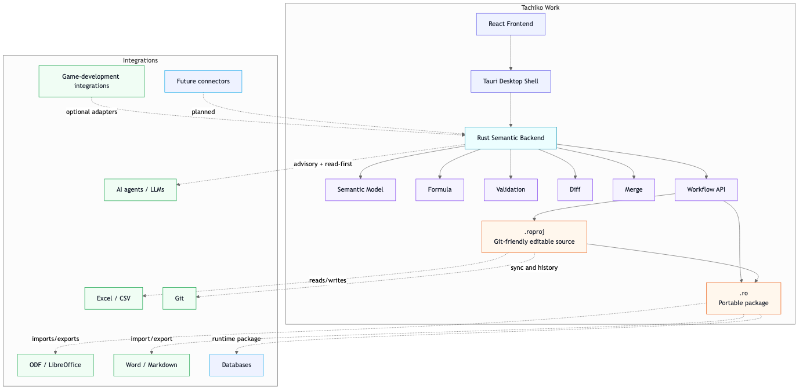

# Tachiko Work Architecture

Architecture documents explain the current model, implemented baseline, target direction, and working hypotheses. They do not all carry the same decision state.

Before treating an architecture detail as permanent, read [`../governance/knowledge-authority.md`](../governance/knowledge-authority.md) and the [`canonical reconciliation register`](../governance/canonical-reconciliation-register.md).

## Architecture diagrams

The diagrams show product architecture direction. Internal crate boundaries, runtime seams, and semantic-model details may evolve where the repository classifies them as Provisional or Open Questions.

## Read by subsystem

### Semantic core and Semantic API

- [`semantic-core-rationale.md`](semantic-core-rationale.md) — why the project is semantic-first; explanatory rationale, not a replacement for ADR authority.
- [`document-model.md`](document-model.md) — accepted semantic-document direction under ADR-0021 progressive strengthening; concrete future mixed-content graph mechanics remain Deferred.
- [`unified-semantic-model.md`](unified-semantic-model.md) — accepted unified-semantic direction across structured data, formulas, views, and AI operations.
- [`rust-crate-architecture.md`](rust-crate-architecture.md) — current implemented crate graph, ADR-0016 ownership, ADR-0020 first-class Semantic API mapping, ADR-0024 proposal ownership, ADR-0026 authorization boundary, and ADR-0022 runtime-host ownership without stabilizing the current Rust source surface.
- [`frontend-backend-boundary.md`](frontend-backend-boundary.md) — GUI/Web/mobile as projection layers over the mandatory Semantic API, trusted authorization boundary, and resident shared Rust runtime.

For the implementable transport-neutral client contract, read
[`../specs/semantic-api.md`](../specs/semantic-api.md). ADR-0020 is semantic
operation authority, ADR-0024 defines immutable revision-pinned proposal
meaning, ADR-0026 defines scoped Grants, trusted footprints, exact Human
Approval, and minimum provenance, and ADR-0022 defines runtime ownership/host
separation. Read [`../specs/semantic-authorization.md`](../specs/semantic-authorization.md)
for the normative authorization contract. Concrete proposal/revision encoding,
session, authorization DTO/state, lifecycle, and transport mechanisms remain
replaceable or separately owned; canonical approval bytes/digests/tokens are
Deferred.

### Storage, formats, and Git

- [`ro-and-roproj-format.md`](ro-and-roproj-format.md) — architecture-level `.roproj` / `.ro` representation direction under ADR-0003 and the Accepted `.roproj/v1` materialization under ADR-0023.
- [`git-native-workflow.md`](git-native-workflow.md) — how Git participates in authoring, review, and history without becoming the user interface.

For implementable format contracts, continue to [`../specs/README.md`](../specs/README.md); architecture prose must not silently override the normative/provisional specification state.

### Runtime and host boundaries

- [`wasm-strategy.md`](wasm-strategy.md) — Accepted ADR-0022 direction: WASM is an execution target for the same resident Rust semantic/application runtime and Semantic API, not a second semantic implementation.
- [`frontend-backend-boundary.md`](frontend-backend-boundary.md) — frontend projection/workflow state, shared runtime authority, explicit snapshot boundaries, and host composition.
- [`performance-model.md`](performance-model.md) — provisional performance guidance that should be refined by evidence.

ADR-0022 accepts resident Rust runtime ownership, the no-second-canonical-client-model rule, host separation, explicit snapshot boundaries, and native/WASM semantic parity. Exact session handles, revision/concurrency, Worker lifecycle, IPC/FFI/network mapping, projection invalidation, persistence/recovery, and serialization/ABI remain Deferred to #93–#95 and related host work.

### AI

- [`ai-native-architecture.md`](ai-native-architecture.md) — accepted direction that AI acts on the semantic model rather than imitating UI actions.

AI is a first-party semantic client under ADR-0007/ADR-0020. Its reviewable
semantic proposals use ADR-0024's immutable revision-pinned SemanticPatch rather
than an AI-only mutation vocabulary. ADR-0026 supplies the Human/Delegated,
capability/scope/Grant, trusted-footprint, exact-Approval, replay/revocation,
provenance, and external-effect boundary. Concrete identifiers, DTOs, state,
lifecycle implementation, projection/redaction, revision mechanics, and
security enforcement remain #29/#30/#93 work.

### Collaboration and future presentation

- [`distributed-collaboration.md`](distributed-collaboration.md) — future collaboration hypothesis/Open Question beyond the implemented semantic merge baseline.
- [`rendering-system.md`](rendering-system.md) — future rendering and semantic-projection hypothesis, including the research → Git-reviewed knowledge → presentation use case tracked in #67, for later Designer MVP work.

## Maturity map

Use these broad cues together with the reconciliation register:

| Area | Current authority/maturity |
| --- | --- |
| Semantic-first platform direction | Accepted |
| First-class Headless Semantic API boundary | Accepted under ADR-0020; exact Rust API and transports remain Provisional/Deferred |
| Progressive semantic strengthening | Accepted under ADR-0021; concrete freeform object/runtime/UI mechanics Deferred |
| `.roproj` source / `.ro` portable-artifact relationship | Accepted under ADR-0003; exact `.roproj/v1` tree/DTO contract Accepted under ADR-0023; production codec pending |
| Current `.ro` v0.1 encoding details | Provisional implemented baseline |
| Rust crate graph | Accepted Milestone 02 boundary implemented; exact Rust API remains Provisional |
| AI as delegated semantic client | Accepted under amended ADR-0007; scoped authorization and exact Human Approval Accepted under ADR-0026; implementation pending #29/#30/#93 |
| Revision-pinned SemanticPatch proposal | Accepted under ADR-0024; ADR-0026 consumes its structural binding without selecting canonical bytes/digest/token; Rust/wire and #29/#93 implementation Deferred |
| Resident Native/WASM runtime and host separation | Accepted under ADR-0022; current snapshot-style implementation may lag; concrete session/transport/persistence mechanics Deferred |
| Distributed collaboration beyond semantic merge | Hypothesis / Open Question |
| Rendering/UI and cross-view projection architecture | Future hypothesis |

## Reading rule for architecture work

1. Start with Product Constitution and Knowledge Authority.
2. Read relevant Accepted ADRs.
3. Use this index to locate the architecture explanation.
4. Read the corresponding specification when an implementable contract matters.
5. Check the target Decision/implementation issue for unresolved details.
6. Check code/tests only when current shipped behavior matters.

If architecture prose conflicts with a higher-authority Accepted decision, reconcile the contradiction explicitly rather than choosing whichever file is newer.
